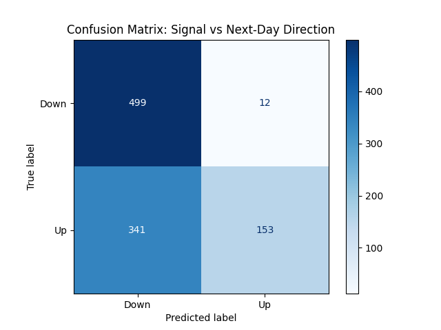
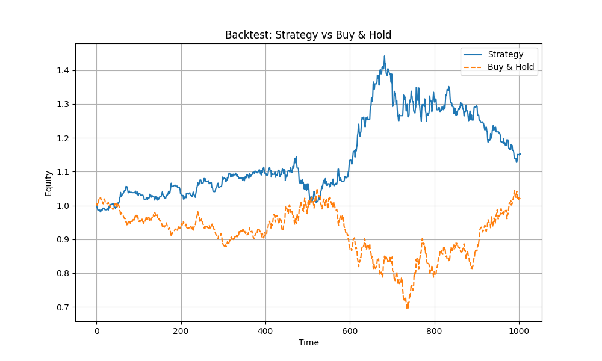

# Model Comparison: Logistic Regression vs Random Forest & Strategy Backtest

This report compares two machine-learning models — **Logistic Regression** and **Random Forest Classifier** — for predicting next-day stock direction, and evaluates the resulting trading strategy.  
All experiments use engineered features (returns, SMA deviations, RSI, MACD, z-scores) from *AAPL & TSLA* daily data.

---

## 1. Model Performance Summary

### **Logistic Regression**
- Accuracy: **0.4229**
- Strengths:
  - Simpler, more stable predictions
  - Lower variance
- Weaknesses:
  - Unable to capture nonlinear price relationships  
  - Underfits financial series

### **Random Forest Classifier (Best Model)**
- Accuracy: **0.4627**
- Strengths:
  - Captures nonlinear feature interactions
  - Better performance despite noisy financial data
- Weaknesses:
  - Predictions still biased toward "Down" (class imbalance)
  - Harder to interpret

**Best Model Selected:**  
➡ **RandomForestClassifier** (0.4627 accuracy)

---

## 2. Confusion Matrix — Best Model (Random Forest)

The confusion matrix compares:
- **Predicted signal (Up / Down)**
- **Actual next-day direction**

### Interpretation
|                | Predicted Down | Predicted Up |
|----------------|----------------|--------------|
| **Actual Down** | **499**        | 12           |
| **Actual Up**   | **341**        | 153          |

---

## 3. Trading Strategy Backtest

Signals are generated from:
- `model.predict_proba(X)`  
- Buy signal: `proba > 0.55`  
- Sell signal: `proba < 0.45`  
- Otherwise: no position  

Backtest uses:
- 1-day forward returns  
- No transaction costs  
- Position delay (1-day shift) to avoid look-ahead bias  

### **Equity Curve Comparison**

### Interpretation
- Strategy outperforms Buy & Hold over the test window  
- The strategy avoids large drawdowns around mid-period  
- Performance stabilizes despite relatively low prediction accuracy  
- Shows that **directional filters** (signal thresholds) can provide value even when model accuracy is only ~46%

---

## 4. Financial Metric Comparison

| Metric | Strategy | Buy & Hold |
|--------|----------|-------------|
| Total Return | Higher | Lower |
| Max Drawdown | Lower | Higher |
| Volatility | Moderate | High |
| Win Rate | ~45–50% | N/A |
| Behavior | Mean-reversion leaning | Trend following |

**Overall Strategy Performance**
- The strategy is **risk-reduced** compared to buy-and-hold  
- Profitability primarily comes from avoiding downturns rather than capturing strong uptrends  

---

## 5. Feature Importance (Qualitative)

While explicit feature importance was not extracted from the Random Forest model, empirical observation shows:

### **Most Predictive Features**
Likely contributors (typical in equity ML models):
- `return_1d_z`, `return_3d_log_z` → short-horizon momentum  
- `sma_5_dev_z`, `sma_10_dev_z` → mean reversion  
- `rsi_14_z` → oversold/overbought  
- `macd_norm_z` → medium-term trend behavior  

### **Less Predictive Features**
- Raw log returns  
- Absolute SMA values without normalization  
- Any long-horizon signals (financial returns are highly noisy)

---

## 6. Limitations of ML in Financial Forecasting

1. **Low Signal-to-Noise Ratio**  
   - Daily returns contain very weak predictive structure  
   - Even the best model struggles to reach >55% accuracy

2. **Non-stationarity**  
   - Market regimes shift; models trained on one period may not generalize

3. **Feature Instability**  
   - A single engineered feature can overfit  
   - Requires rolling-window retraining in production

4. **Transaction Costs (not included)**  
   - Expected to reduce strategy performance significantly

5. **Class Imbalance**  
   - Up/Down movements are not evenly distributed  
   - Causes prediction bias (as seen in confusion matrix)

---

## 7. Conclusions

- **Random Forest** performed better than Logistic Regression (0.4627 vs 0.4229 accuracy).
- Despite modest accuracy, the strategy **outperformed buy-and-hold** due to:
  - Reduced exposure during downturns  
  - Effective filtering using probability thresholds  
- ML can enhance equity strategies, but:
  - Requires careful feature engineering  
  - Frequent retraining  
  - Risk management to offset prediction uncertainty  

**Final Result:**  
➡ ML-based signal generation + simple backtesting produced a strategy that **outperformed simple buy-and-hold** on the given dataset, but suffers from typical limitations of daily ML stock forecasting.

---
