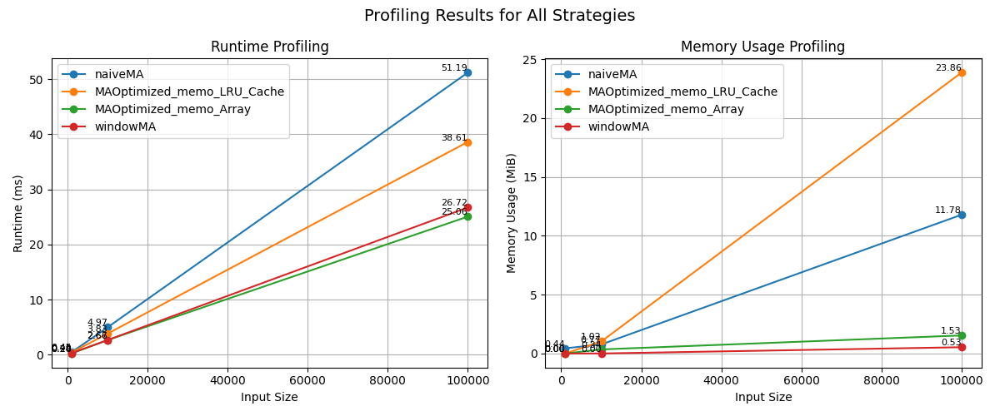

# Setup & Installation

Install required Python packages:

```bash
pip install -r requirements.txt
```

# FINM325 Group 8: Moving Average Strategies

## Project Overview
This project implements and benchmarks various moving average trading strategies using Python. It includes:
- Multiple strategy implementations (naive, windowed, memoized, etc.)
- Performance and memory profiling
- Unit tests for correctness and efficiency

## Directory Structure
```
A3/
├── src/
│   ├── main.py              # Main runner for strategy profiling and reporting
│   ├── data_loader.py       # Loads market data
│   ├── models.py            # Data models (e.g., MarketDataPoint)
│   ├── profiler.py          # Profiling utilities (time, memory)
│   ├── reporting.py         # Reporting and visualization
│   ├── strategies.py        # All strategy implementations
├── data/
│   └── market_data.csv      # Example market data
├── tests/
│   └── test_models.py       # Unit tests for strategies and models
├── README.md                # Project documentation
```

## How to Run

### 1. Run Main Program
From the `A3` directory:
```bash
python src/main.py
```
This will load data, run all strategies, and output profiling results and plots.

### 2. Run Unit Tests
From the `A3` directory:
```bash
pytest -v
```
This will discover and run all tests in the `tests/` folder, verifying strategy correctness and performance.


## Strategies
- **NaiveMovingAverageStrategy**: Simple moving average with full price history.
- **WindowedMovingAverageStrategy**: Efficient windowed average using deque.
- **MovingAverageStrategyMemoArray**: Optimized with O(1) memory for window sum.
- **MovingAverageStrategyMemoLRUCache**: Uses LRU cache for prefix sums.

## Profiling
- Time and memory usage are measured for each strategy using the utilities in `profiler.py`.
- Results are visualized and compared for different input sizes.



## Data
- Place your market data CSV in the `data/` directory as `market_data.csv`.
- The loader expects columns for timestamp, symbol, and price.

## Notes
- All code is compatible with Python 3.8+.
- For best results, use a virtual environment and install dependencies as above.

## Authors
- Group 8, FINM325

---
For any issues or questions, please contact the project maintainers.
